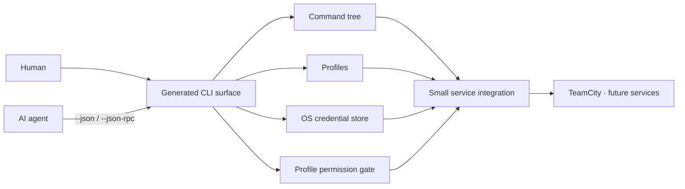

# AI CLI Factory

**Build the next service CLI faster than the previous one.**

AI CLI Factory is a TypeScript/Node.js workspace for creating consistent command-line
integrations. Each product describes a command tree and its service calls; the factory supplies
the repetitive parts: help, profiles, protected credentials, human and JSON output, and a
persistent JSON-RPC session for agents.

The repository name is `EyeAuras.CliFactory`. The human-facing project name is **AI CLI
Factory**.

> Status: foundation stage. The common npm package and TeamCity operations/authoring integration
> are implemented, exposing all 449 routes in the frozen TeamCity 2026.1 REST inventory,
> with mocked REST contracts, permission gates, profiles, JSON, JSON-RPC, and a local profile-backed
> integration proof. Two RANDOM.ORG examples demonstrate optional IPC servers and headless
> Playwright with a shared command contract. The APIs are not stable yet.



## Browser-backed CLI example

[HTTP](integrations/random-rest/README.md) and [Playwright](integrations/random-pw/README.md)
implement the same two RANDOM.ORG commands without API keys. Both reuse a self-starting local
host; only PW starts Chromium. Install test browsers explicitly with `npm run browser:install`
(`-- --with-deps` on Linux when needed), then run `npm test`. Browser tests use synthetic pages,
not the live service. Headed tests on display-less Linux use `xvfb-run --auto-servernum npm test`.
PW adds `--headed` and `--record-video` with automatic idle-boundary browser/context switching.
See [optional runtime contracts](docs/runtime-modules.md) and the detailed
[browser observation guide](docs/browser-observation.md).

## Why a factory?

Service CLIs tend to repeat the same infrastructure and slowly drift apart. This project makes
those decisions once:

- Commands form a real tree: `teamcity-cli jobs list`, `teamcity-cli jobs show <id>`, and deeper
  branches use the same model. Help is generated at every level.
- Handlers return data. The framework owns human rendering and the mandatory `--json` form, so
  integration authors do not implement output twice.
- `auth login`, `auth status`, and `auth logout` are standard commands. The shipped token helper
  uses the OS credential store, never profile JSON. The design also permits explicitly declared
  browser auth state in profile AppData; app-owned auth and optional IPC/Playwright modules are
  [planned](docs/runtime-modules.md), not shipped yet.
- `profile` commands isolate endpoints and configuration such as UAT and Production. Handlers get
  the familiar PoeShared-style `context.appArguments.AppDataDirectory` for profile-owned files.
- `permissions` gates classify commands as `ReadOnly`, `Update`, or an integration-defined
  category. Permission choices are profile-specific; `Update` starts disabled.
- `--json-rpc` keeps the process alive and accepts multiple commands over newline-delimited
  JSON-RPC 2.0, avoiding repeated Node startup for agent workflows.
- HTTP behavior is developed mock-first. Sanitized fixtures can be captured from a real service
  or derived from its documentation, then used for deterministic tests.

## The authoring surface

An integration describes commands once, classifies each leaf, and returns ordinary objects:

```ts
import { command, createCli, Permission, tokenAuth } from "@eyeauras/cli-factory";

const cli = createCli({
  name: "teamcity-cli",
  description: "TeamCity command line client",
  permissions: {},
  profile: {
    fields: [
      {
        name: "url",
        flags: "--url <url>",
        description: "TeamCity server URL",
        required: true,
      },
    ],
  },
  auth: tokenAuth({ env: "TEAMCITY_TOKEN", validate: validateToken }),
  commands: [
    command("jobs", "Work with TeamCity build configurations", [
      command("list", "List jobs", async (_input, context) =>
        createClient(context).listJobs(), {
          permission: Permission.ReadOnly,
        }),
    ]),
  ],
});
```

That declaration produces the tree help and both output modes:

```text
teamcity-cli help
teamcity-cli jobs
teamcity-cli jobs list
teamcity-cli jobs list --json
```

It also adds the common commands:

```text
teamcity-cli profile list
teamcity-cli profile configure production --url https://teamcity.example.com --token-stdin
teamcity-cli profile create staging --url https://staging-teamcity.example.com
teamcity-cli profile set production --url https://new-teamcity.example.com
teamcity-cli profile set-default production
teamcity-cli profile delete old-uat

teamcity-cli auth login --token-stdin
teamcity-cli auth status
teamcity-cli auth logout

teamcity-cli permissions list
teamcity-cli permissions grant Update --profile uat
teamcity-cli permissions revoke Update --profile uat
```

For automation, prefer `--token-stdin` or the integration's environment variable. Supplying a
secret as a command-line argument can expose it through process inspection.

## Persistent JSON-RPC mode

Start a session:

```text
teamcity-cli --json-rpc
```

Then send one JSON object per line:

```json
{"jsonrpc":"2.0","id":1,"method":"cli.execute","params":{"argv":["jobs","list"]}}
{"jsonrpc":"2.0","id":2,"method":"cli.execute","params":{"argv":["jobs","show","MyBuild"]}}
```

Each request receives a JSON-RPC result or error on its own line. The same process and profile
state remain available for the whole session.

## Repository layout

| Path | Purpose |
|---|---|
| `packages/core` | Reusable CLI tree, AppArguments, output, profile, auth, permissions, and JSON-RPC primitives |
| `integrations/teamcity` | First in-house product and executable example |
| `integrations/teamcity/README.md` | Shipped TeamCity command tree and operating guide |
| `integrations/random-rest` | Minimal anonymous RANDOM.ORG HTTP example (two commands) |
| `docs/DESIGN.md` | Canonical architecture and invariants |
| `docs/integrations.md` | How to build an in-repo or external integration |
| `docs/testing.md` | Mock-first and opt-in integration-test workflow |
| `docs/roles`, `docs/practices` | GitHub Issues, Reconciliation Lead, and phased workstream practices |
| `.workspace/workstreams` | Tracked resumable plans and ledgers |
| `scripts/bootstrap.cs` | .NET 10 file-based bootstrap for submodules and npm dependencies |

`CliWrap.ts` is planned as a separate repository and will be connected as a Git submodule when
its first process-pipeline consumer is implemented. It is deliberately not represented by an
empty placeholder today.

## Getting started

Requirements: Node.js 22+ and npm 11+. .NET 10 is only needed for the one-command bootstrap.

```text
dotnet run --file scripts/bootstrap.cs
npm run browser:install
npm test
npm run teamcity -- --help
```

No service URL is compiled into the TeamCity CLI. Configure an authenticated profile explicitly
before making a real request:

```text
$env:TEAMCITY_TOKEN | npm run teamcity -- profile configure default --url https://teamcity.example.com --token-stdin
npm run teamcity -- jobs list --json
```

For a credential-free read-only trial, JetBrains currently exposes a public TeamCity server with
guest access. It is an explicit example profile, never an automatic default or background request:

```text
npm run teamcity -- profile configure jetbrains-demo --url https://teamcity.jetbrains.com --guest
npm run teamcity -- server status --profile jetbrains-demo --json
```

Running `teamcity-cli` or a service command in an ordinary terminal also starts the same guided
configuration when the selected profile is incomplete. JSON, JSON-RPC, redirected stdin, and
programmatic execution never prompt; their error names the exact `profile configure` command.

The shipped TeamCity tree covers server status, projects, jobs, builds and their diagnostics,
the build queue, agents, project/job authoring, plain parameters, steps, existing VCS roots,
triggers, features, snapshot/artifact dependencies, agent requirements, templates, agent pools,
agent eligibility, queue positioning, build annotations and statistics.
The tree also includes cloud/VCS/versioned settings, investigations/mutes, account/role/server
administration, deployment dashboards, bounded file transfers and keyring-backed secure values.
Mutations require Update or the explicit Admin/Credentials category. The local v2 implementation
exposes **449/449 REST method/path pairs (100%)**:235 GET and214 mutation routes. This is route
coverage, not every payload variant or live mutation verification. Config-parameter reset and
bulk unmute intentionally report native acknowledgement without verified postconditions.
See the [TeamCity CLI guide](integrations/teamcity/README.md) and
[final local reconciliation](.workspace/workstreams/teamcity-v2/final-review.md).

On bash/zsh, use `printf '%s' "$TEAMCITY_TOKEN" | npm run teamcity -- auth login --token-stdin`.

## RANDOM.ORG example

The [RANDOM.ORG example](integrations/random-rest/README.md) provides `random-rest-cli integers`
and `random-rest-cli sequence` using the older public HTTP API without an API key. Configure only
an operator contact for User-Agent; the public service URL has an explicit default. It demonstrates
the existing factory without adding IPC or a browser dependency. Both commands support `--json`
and stdio JSON-RPC. Run `npm exec -- random-rest-cli --help` after installing/building the workspace.

## Development principles

- Start from a real user command, then extract only the reusable mechanism it proves.
- Keep integrations thin and service-shaped; keep generic behavior in `packages/core`.
- Classify every gated service leaf correctly; never label a side effect `ReadOnly`.
- Never store secrets in config, fixtures, logs, snapshots, or Git.
- Derive non-secret profile-owned files from `AppArguments.AppDataDirectory`; CLIs are not portable.
- Make mock tests the default and real-service tests explicit and opt-in.
- Keep real-profile proofs as separate local-only packaged-CLI runs; never put them in CI/CD.
- Prefer deletion and direct platform/library use over new abstraction layers.
- Use GitHub Issues for feature/bug scope and acceptance; use workstreams for phased execution and evidence.
- AI agents begin at [`AGENTS.md`](AGENTS.md) and treat [`docs/DESIGN.md`](docs/DESIGN.md) as the
  canonical specification.

Start with [writing an integration](docs/integrations.md), then use [the design](docs/DESIGN.md)
and [testing workflow](docs/testing.md) for the detailed contract. Planned work follows the
[GitHub Issues practice](docs/practices/github-issues.md).
