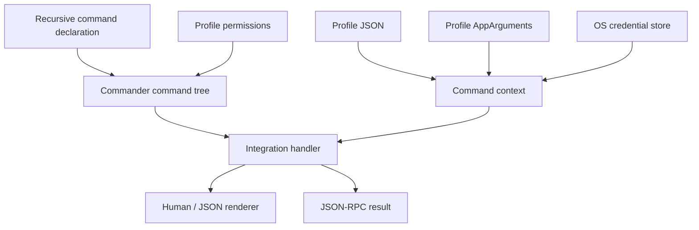

# AI CLI Factory design

This document is the canonical specification for AI CLI Factory. Code and shorter documentation
must agree with it. The project is intentionally early: sections marked **planned** describe a
direction, not a shipped guarantee.

## Product goal

The factory exists to make each new service CLI cheaper to build, easier for a human to discover,
and predictable for an AI to operate. Reuse is successful only when it removes code from a real
integration without hiding the service's domain.

The first proving consumer is TeamCity. In-house integrations
live beside the framework under `integrations/`; they are products, executable examples, and the
source of evidence for extracting reusable features.

## Core invariants

### Commands are a tree

A CLI is a recursive command declaration. Every node has a name and description; branch nodes
contain children and leaf nodes execute handlers. The framework generates help at every node.
Authors must not hand-write a dispatch switch or separate help pages.

A service option may declare `required: true` in its existing `OptionDefinition`. The parser
rejects a missing required value before profile onboarding, keyring access or the handler, in
ordinary CLI, programmatic and JSON-RPC execution. A declared default satisfies this requirement;
existing option parsing still applies to supplied values. This is distinct from required profile
fields, which the interactive configurator may prompt for.
Generated help marks required options without defaults. Help and argument errors never terminate
the host process.

Literal leaf declarations infer required positional strings in their inline callback from the
existing command name. The small inferred grammar uses ASCII letters, digits, underscores and
hyphens in names, with single spaces between the command and required `<argument>` tokens.
A supported declaration without arguments has an empty argument object. Options keep their broad
unknown-record type; service validators still own numeric IDs and other domain constraints.

The complete declaration falls back to `Record<string, unknown>` for dynamic or union names,
duplicate arguments, optional/variadic tokens, other whitespace or unsupported syntax. Runtime
parsing remains unchanged, including its wider Commander syntax. Existing explicitly annotated
`CommandInput` and `CommandHandler` callbacks retain their broad types. Inference describes the
literal callback when invoked through the factory parser. The stored mutable `CommandDefinition`
remains broad; changing its name/run or manually invoking its erased handler is outside that
inference guarantee.

### Handlers return domain data

Command handlers return values and do not decide whether output is human-readable or JSON. The
runner owns presentation. `--json` emits exactly one JSON value for a non-streaming command and
writes diagnostics to stderr.

This separation is the basis for future output formats. A new format must be implemented once in
the runner, not once per command.

### Profiles own non-secret configuration

A profile is a named JSON object containing values such as a base URL, tenant, project, or user
name. One profile is the default. A default profile exists even before configuration is persisted,
and the collection can never become empty. Profile files contain no passwords, access tokens,
refresh tokens, private keys, or cookies.

Profile fields that are prerequisites for service commands are declared `required`. The virtual
default profile may therefore exist in an incomplete state without inventing a product-specific
endpoint. In an ordinary TTY, starting the root command or a service leaf enters the same generic
configuration flow. `profile configure [name]` is its explicit form: it accepts the integration's
profile field options and completes authentication when required. JSON, JSON-RPC, redirected
stdin/stdout, and programmatic execution never prompt; they fail before the handler with an
actionable configuration command.

The standard lifecycle is explicit: `profile create <name>` creates, `profile set <name>` updates
an existing profile, `profile set-default <name>` chooses the default, and `profile delete <name>`
removes a non-default profile. The default profile cannot be deleted until another profile is made
default; the final remaining profile cannot be deleted. Deletion also removes the integration's
known stored authentication credential for that profile.

Profile names are ASCII and must be unique ignoring letter case on every supported platform, so
names such as `Fixture` and `fixture` cannot share a case-insensitive filesystem directory.
A single existing mixed-case name keeps its spelling, data path and credential identity; explicit
profile lookup remains exact and does not introduce case-insensitive aliases. Creating or
configuring a new colliding name fails before prompting, validation or any persisted change.
An existing document containing case-colliding names fails closed before profile or credential
mutation, including deletion. Core never chooses a winner or automatically migrates, renames or
deletes data. To recover, first back up `profiles.json` and profile-owned data, then manually
resolve conflicting names to distinct identities and reconfigure credentials for renamed profiles.

Profile identity is part of the secret key. Switching from `uat` to `production` must never reuse
the other profile's credential accidentally.

Profile identity also owns a current-user application-data root. Configuration, logs, temporary
files, caches, downloaded data, and other profile-specific files derive from that root. A profile
must never construct a path from the current working directory or the executable directory.

### Permission gates are profile-specific safety policy

An integration may enable the permission gate. Once enabled, every service leaf command must name
one known category or CLI construction fails. The standard categories are `ReadOnly` and `Update`:
`ReadOnly` starts enabled; `Update` starts disabled. Integrations may append categories when a real
operator boundary needs more precision.

Permission selection follows the profile. Granting an update category for UAT must not grant it
for Production. The runner checks the category before calling the handler, so denial happens before
the HTTP boundary.

The gate is defense-in-depth for humans and AI agents, not an authentication or authorization
boundary. A remote service still enforces actual identity and rights. Built-in configuration
commands remain ungated so users can inspect and recover their local setup.

### Secrets use the operating system

The default secret store delegates to the platform credential facility through a native binding:
Windows Credential Manager backed by DPAPI, macOS Keychain, and a system keyring on Linux.
There is no plaintext fallback. If the secure store is unavailable, authentication fails with an
actionable error.

Integrations define the authorization protocol and validation call. The factory defines the
storage lifecycle and standard `auth login`, `auth status`, and `auth logout` commands. The first
shipped helper covers static bearer/API tokens; OAuth/device-code helpers are planned when a real
consumer needs them.

### Machine output is a first-class contract

Every leaf command supports `--json`. JSON values use stable service/domain field names and do not
contain ANSI decoration. Errors have a stable structured form in JSON-RPC mode; a future CLI-wide
JSON error envelope must update the current contract, consumers, documentation, and contract tests
together; it must not retain a parallel old format.

### JSON-RPC is a persistent transport

`--json-rpc` starts newline-delimited JSON-RPC 2.0 on stdin/stdout. The initial method is
`cli.execute` with `{ "argv": string[] }`. A request executes the same command tree as a normal
invocation and returns the command's domain value.

The process remains alive until stdin closes or it receives a termination signal. Protocol output
owns stdout while the transport is active; logs and diagnostics belong on stderr. Server-pushed
notifications and long-running subscriptions are **planned** and will build on the same channel.

### Service boundaries stay visible

The core package knows nothing about TeamCity resources. Integrations own endpoint paths, DTOs,
pagination rules, and service terminology. A service client depends on `fetch`, which makes the
network boundary replaceable in tests without inventing another HTTP abstraction.

## Runtime shape



Commander is used for parsing and automatic nested help. `@napi-rs/keyring` is the native secret
store binding. Both are replaceable implementation choices, not APIs exposed to integrations.

## AppArguments and current-user application data

Core exports the familiar PoeShared-style `AppArguments` API. Its public storage names and path
composition intentionally match the C#/Rust contract:

```text
EnvironmentAppData/<AppName>              = RoamingAppDataDirectory
EnvironmentLocalAppData/<AppName>         = LocalAppDataDirectory
RoamingAppDataDirectory/<Profile>          = AppDataDirectory
AppDataDirectory/temp                      = TempDirectory
AppDataDirectory/log                       = LogDirectory()
```

`AppName` is the CLI's stable `applicationId`; changing it selects a different user-data and
credential namespace. Document the required reconfiguration rather than adding old-namespace
fallbacks, and leave existing user data untouched. `profiles.json` is application-wide and lives directly in
`RoamingAppDataDirectory`. All other profile-owned files derive from `AppDataDirectory` using
ordinary `node:path` composition. Secrets remain in the OS credential store and never enter these
directories.

The environment roots belong to the current OS user:

| Platform | `EnvironmentAppData` | `EnvironmentLocalAppData` |
|---|---|---|
| Windows | `%APPDATA%` | `%LOCALAPPDATA%` |
| macOS | `~/Library/Application Support` | same |
| Linux | `$XDG_DATA_HOME` or `~/.local/share` | same |

CliFactory applications are deliberately non-portable. There is no `--dataFolder`, sibling
`data` directory detection, executable-relative fallback, or public environment-variable override.
Tests inject an `AppArgumentsEnvironment` or `AppArguments` instance instead of redirecting a real
application through process-global state.

Unlike a PoeShared desktop process, a persistent CLI process may execute commands against different
profiles. Core therefore creates a profile-specific `AppArguments` view for every command and exposes
it as `context.appArguments`. There is no mutable process-wide active AppData directory.

Profile-document writes use a temporary file followed by rename so an interrupted write cannot
leave half a JSON document. Deleting a profile deletes its known credential and its complete
`AppDataDirectory`; default-profile and final-profile protections run before deletion.

The profile document has a versioned shape:

```json
{
  "version": 1,
  "active": "default",
  "profiles": {
    "default": { "url": "https://teamcity.example.com", "guest": false }
  },
  "permissions": {
    "default": ["ReadOnly"]
  }
}
```

The `permissions` property is absent until a user changes a profile away from integration
defaults. An explicit empty array means every service permission is disabled for that profile.

## Authentication contract

The built-in token flow resolves a candidate in this order during `profile configure` or
`auth login`:

1. stdin when `--token-stdin` is present;
2. the integration-specific environment variable;
3. a masked interactive terminal prompt.

Stored credentials are not configure/login candidates. Prompting requires ordinary rendered
execution without `--json`, with stdin, stdout and stderr all attached to a TTY. JSON-RPC and
programmatic execution never prompt or consume `--token-stdin`; an explicit rendered CLI stdin
flow remains available.

`profile configure` validates the profile name, non-secret configuration and new authentication
candidate before changing persistent state. Missing or rejected candidates preserve the existing
profile and credential and do not create a new profile. After successful authentication validation,
configure removes the previous credential, saves the candidate profile, then saves the validated
credential. A removal failure leaves configuration unchanged. A later storage failure can leave
an unauthenticated profile; the error directs the user to `profile configure <name> --token-stdin`.
This fails closed across two stores; it is not an atomic transaction, and it never rolls back an
old credential onto a new endpoint. `auth login` validates against the current profile and changes
only the credential. Configure/login storage failures expose no backend error details or causes.
Ordinary `profile set` remains a non-auth configuration operation.

No-auth integrations and profiles that opt out of token authentication configure without accessing
credentials. `auth login` rejects such profiles.

The token is validated by the integration before it is persisted. An integration may declare
that a configured profile does not require a token, for example TeamCity guest access; the
service-specific switch and HTTP behavior stay in that integration. Authentication status may
optionally revalidate the stored token, but must never print it. Logout deletes only the active
profile's credential.

## Permission contract

Enabling `permissions: {}` adds standard `permissions list/grant/revoke` commands. Integration
authors attach one category to each service leaf in the same command declaration that owns its
handler. `list`, `get`, `status`, search, and inspection normally use `ReadOnly`. Create, trigger,
cancel, comment, upload, edit, and delete operations use at least `Update`.

Custom categories contain a stable CLI-safe name, description, and optional default. They are not
hierarchical: enabling `Update` does not implicitly enable a custom `DeployProduction` category.
Category changes are ordinary profile configuration and intentionally never contain secrets.

## Testing model

Development follows a thin vertical TDD loop:

1. Add the minimum authentication/profile skeleton needed to reach the service.
2. Configure a real current-user profile through the built CLI and OS credential store.
3. Run an explicit local, read-only integration proof through the compiled CLI process, or use an
   official documentation sample when a real service is unavailable.
4. Remove credentials and sensitive/customer data before saving a minimal fixture.
5. Express the desired command as a failing test against an HTTP mock.
6. For a side effect, first prove its permission denial occurs before the mock sees a request.
7. Implement the smallest client and command code that passes the test.
8. Re-run the local proof while debugging; keep mocked tests deterministic and in the default suite.

MSW intercepts the native `fetch` boundary in Node tests. Fixtures are data, not a second client
implementation. Full rules are in [`testing.md`](testing.md).

A profile-backed integration proof is development evidence, not regression coverage. It uses a
named profile from the current user's normal AppData and credentials from the normal OS keyring; it
does not accept a test URL or token. It invokes the packaged CLI boundary and a fixed, bounded
inventory of `ReadOnly` commands. It is a separate explicit script, refuses CI environments before
networking, never prints or persists raw responses, and is never included in `npm test`. Mocked tests
remain the only service-contract tests required in CI.

## Submodules and CliWrap.ts

Submodules are allowed for separately versioned source products. They are initialized by the
.NET 10 file-based app at `scripts/bootstrap.cs`, which runs `git submodule sync` and
`git submodule update --init --recursive` before installing npm dependencies.

`CliWrap.ts` will port the useful process/pipeline semantics of C# CliWrap to TypeScript in its own
repository. The submodule is added only together with its first working consumer and pinned to a
reviewed commit. The CLI factory must not grow a speculative process framework while that evidence
does not exist.

## Package boundaries

### `packages/core`

Owns recursive command construction, standard commands, output, profile persistence, permission
gates, secret persistence, the `AppArguments` current-user data contract, and JSON-RPC transport.
It must remain service-agnostic.

### `integrations/<service>`

Owns service DTOs, client calls, auth validation, command vocabulary, and executable packaging.
An integration may depend on core; core must never depend on an integration.

### `CliWrap.ts` submodule (planned)

Owns process execution and pipeline composition. It remains independently testable and releasable.

## Non-goals for the foundation

- A code generator before two real integrations demonstrate repeated authoring work.
- A plugin runtime or dependency-injection container.
- A universal service DTO, pagination model, or HTTP client wrapper.
- A plaintext or silently degraded secret store.
- Portable or executable-relative application data.
- Treating local permission gates as a replacement for remote authorization or human policy.
- Publishing npm packages before the public API has a second consumer.
- Claiming streaming subscriptions before JSON-RPC notifications have cancellation and
  backpressure tests.

## Evolution rule

While the project is in its initial stage, changes are clean breaks. There is no obligation to
preserve an earlier API, CLI syntax, configuration shape, or development workflow. Remove superseded
implementations in the same change that introduces their replacement; update in-repo consumers,
tests, and docs together. Do not add legacy branches, compatibility shims, deprecated aliases,
automatic old-format migrations, or transition periods with two supported paths. External consumers
update to the new contract when they update their pinned factory version. Explain any required
reconfiguration without silently deleting user-owned configuration or credentials.

Promote-on-use: a feature enters core only when a current integration consumes it. When two
integrations differ, preserve the difference until their shared shape is demonstrated. The goal is
homogeneous operation, not forced homogeneity of unrelated service domains.

The implementation path for new products is documented in [`integrations.md`](integrations.md).
Feature and bug scope enters the development loop through
[`practices/github-issues.md`](practices/github-issues.md). Phased integrations use the
Reconciliation Lead practice in [`practices/workstreams.md`](practices/workstreams.md).
