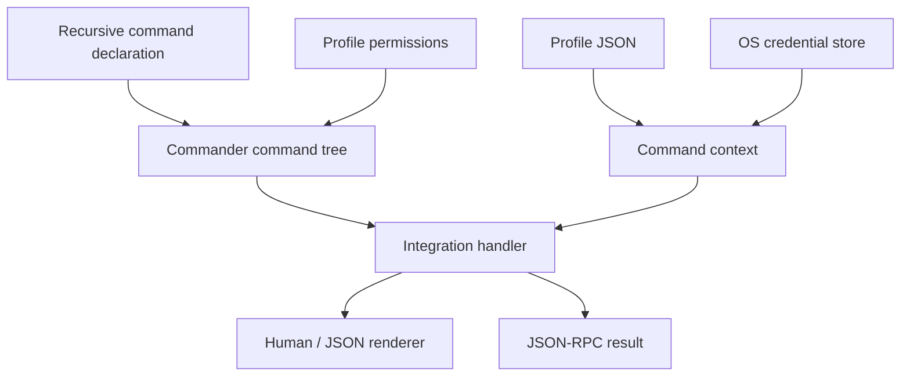

# AI CLI Factory design

This document is the canonical specification for AI CLI Factory. Code and shorter documentation
must agree with it. The project is intentionally early: sections marked **planned** describe a
direction, not a shipped guarantee.

## Product goal

The factory exists to make each new service CLI cheaper to build, easier for a human to discover,
and predictable for an AI to operate. Reuse is successful only when it removes code from a real
integration without hiding the service's domain.

The first proving consumer is TeamCity at `https://teamcity.example.com`. In-house integrations
live beside the framework under `integrations/`; they are products, executable examples, and the
source of evidence for extracting reusable features.

## Core invariants

### Commands are a tree

A CLI is a recursive command declaration. Every node has a name and description; branch nodes
contain children and leaf nodes execute handlers. The framework generates help at every node.
Authors must not hand-write a dispatch switch or separate help pages.

### Handlers return domain data

Command handlers return values and do not decide whether output is human-readable or JSON. The
runner owns presentation. `--json` emits exactly one JSON value for a non-streaming command and
writes diagnostics to stderr.

This separation is the basis for future output formats. A new format must be implemented once in
the runner, not once per command.

### Profiles own non-secret configuration

A profile is a named JSON object containing values such as a base URL, tenant, project, or user
name. One profile is the default. A default profile exists even before configuration is persisted,
and the collection can never become empty. Profile files contain no passwords, access tokens,
refresh tokens, private keys, or cookies.

The standard lifecycle is explicit: `profile create <name>` creates, `profile set <name>` updates
an existing profile, `profile set-default <name>` chooses the default, and `profile delete <name>`
removes a non-default profile. The default profile cannot be deleted until another profile is made
default; the final remaining profile cannot be deleted. Deletion also removes the integration's
known stored authentication credential for that profile.

Profile identity is part of the secret key. Switching from `uat` to `production` must never reuse
the other profile's credential accidentally.

### Permission gates are profile-specific safety policy

An integration may enable the permission gate. Once enabled, every service leaf command must name
one known category or CLI construction fails. The standard categories are `ReadOnly` and `Update`:
`ReadOnly` starts enabled; `Update` starts disabled. Integrations may append categories when a real
operator boundary needs more precision.

Permission selection follows the profile. Granting an update category for UAT must not grant it
for Production. The runner checks the category before calling the handler, so denial happens before
the HTTP boundary.

The gate is defense-in-depth for humans and AI agents, not an authentication or authorization
boundary. A remote service still enforces actual identity and rights. Built-in configuration
commands remain ungated so users can inspect and recover their local setup.

### Secrets use the operating system

The default secret store delegates to the platform credential facility through a native binding:
Windows Credential Manager backed by DPAPI, macOS Keychain, and a system keyring on Linux.
There is no plaintext fallback. If the secure store is unavailable, authentication fails with an
actionable error.

Integrations define the authorization protocol and validation call. The factory defines the
storage lifecycle and standard `auth login`, `auth status`, and `auth logout` commands. The first
shipped helper covers static bearer/API tokens; OAuth/device-code helpers are planned when a real
consumer needs them.

### Machine output is a first-class contract

Every leaf command supports `--json`. JSON values use stable service/domain field names and do not
contain ANSI decoration. Errors have a stable structured form in JSON-RPC mode; a future CLI-wide
JSON error envelope will be introduced only with compatibility tests.

### JSON-RPC is a persistent transport

`--json-rpc` starts newline-delimited JSON-RPC 2.0 on stdin/stdout. The initial method is
`cli.execute` with `{ "argv": string[] }`. A request executes the same command tree as a normal
invocation and returns the command's domain value.

The process remains alive until stdin closes or it receives a termination signal. Protocol output
owns stdout while the transport is active; logs and diagnostics belong on stderr. Server-pushed
notifications and long-running subscriptions are **planned** and will build on the same channel.

### Service boundaries stay visible

The core package knows nothing about TeamCity resources. Integrations own endpoint paths, DTOs,
pagination rules, and service terminology. A service client depends on `fetch`, which makes the
network boundary replaceable in tests without inventing another HTTP abstraction.

## Runtime shape



Commander is used for parsing and automatic nested help. `@napi-rs/keyring` is the native secret
store binding. Both are replaceable implementation choices, not APIs exposed to integrations.

## Configuration locations

Application state is stored below the platform's conventional user config root:

- Windows: `%APPDATA%/<application-id>/profiles.json`
- macOS: `~/Library/Application Support/<application-id>/profiles.json`
- Linux: `$XDG_CONFIG_HOME/<application-id>/profiles.json` or `~/.config/<application-id>`

`CLI_FACTORY_HOME` overrides the root for tests and controlled automation. Writes use a temporary
file followed by rename so an interrupted write cannot leave half a JSON document.

The profile document has a versioned shape:

```json
{
  "version": 1,
  "active": "default",
  "profiles": {
    "default": { "url": "https://teamcity.example.com" }
  },
  "permissions": {
    "default": ["ReadOnly"]
  }
}
```

The `permissions` property is absent until a user changes a profile away from integration
defaults. An explicit empty array means every service permission is disabled for that profile.

## Authentication contract

The built-in token flow resolves a candidate in this order:

1. stdin when `--token-stdin` is present;
2. the integration-specific environment variable;
3. a masked interactive terminal prompt.

The token is validated by the integration before it is persisted. Authentication status may
optionally revalidate the stored token, but must never print it. Logout deletes only the active
profile's credential.

## Permission contract

Enabling `permissions: {}` adds standard `permissions list/grant/revoke` commands. Integration
authors attach one category to each service leaf in the same command declaration that owns its
handler. `list`, `get`, `status`, search, and inspection normally use `ReadOnly`. Create, trigger,
cancel, comment, upload, edit, and delete operations use at least `Update`.

Custom categories contain a stable CLI-safe name, description, and optional default. They are not
hierarchical: enabling `Update` does not implicitly enable a custom `DeployProduction` category.
Category changes are ordinary profile configuration and intentionally never contain secrets.

## Testing model

Development follows a thin vertical TDD loop:

1. Add the minimum authentication/profile skeleton needed to reach the service.
2. Make one explicit opt-in request to the real service or use an official documentation sample.
3. Remove credentials and sensitive/customer data before saving a fixture.
4. Express the desired command as a failing test against an HTTP mock.
5. For a side effect, first prove its permission denial occurs before the mock sees a request.
6. Implement the smallest client and command code that passes the test.
7. Keep real-service tests opt-in; keep mock tests deterministic and in the default suite.

MSW intercepts the native `fetch` boundary in Node tests. Fixtures are data, not a second client
implementation. Full rules are in [`testing.md`](testing.md).

## Submodules and CliWrap.ts

Submodules are allowed for separately versioned source products. They are initialized by the
.NET 10 file-based app at `scripts/bootstrap.cs`, which runs `git submodule sync` and
`git submodule update --init --recursive` before installing npm dependencies.

`CliWrap.ts` will port the useful process/pipeline semantics of C# CliWrap to TypeScript in its own
repository. The submodule is added only together with its first working consumer and pinned to a
reviewed commit. The CLI factory must not grow a speculative process framework while that evidence
does not exist.

## Package boundaries

### `packages/core`

Owns recursive command construction, standard commands, output, profile persistence, permission
gates, secret persistence, and JSON-RPC transport. It must remain service-agnostic.

### `integrations/<service>`

Owns service DTOs, client calls, auth validation, command vocabulary, and executable packaging.
An integration may depend on core; core must never depend on an integration.

### `CliWrap.ts` submodule (planned)

Owns process execution and pipeline composition. It remains independently testable and releasable.

## Non-goals for the foundation

- A code generator before two real integrations demonstrate repeated authoring work.
- A plugin runtime or dependency-injection container.
- A universal service DTO, pagination model, or HTTP client wrapper.
- A plaintext or silently degraded secret store.
- Treating local permission gates as a replacement for remote authorization or human policy.
- Publishing npm packages before the public API has a second consumer.
- Claiming streaming subscriptions before JSON-RPC notifications have cancellation and
  backpressure tests.

## Evolution rule

Promote-on-use: a feature enters core only when a current integration consumes it. When two
integrations differ, preserve the difference until their shared shape is demonstrated. The goal is
homogeneous operation, not forced homogeneity of unrelated service domains.

The implementation path for new products is documented in [`integrations.md`](integrations.md).
Feature and bug scope enters the development loop through
[`practices/github-issues.md`](practices/github-issues.md). Phased integrations use the
Reconciliation Lead practice in [`practices/workstreams.md`](practices/workstreams.md).
