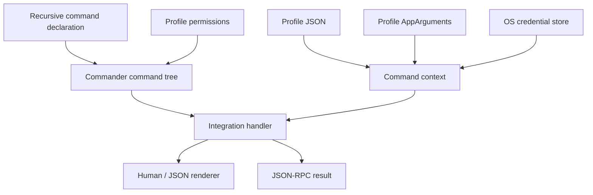

# AI CLI Factory design

This document is the canonical specification for AI CLI Factory. Code and shorter documentation
must agree with it. The project is intentionally early: sections marked **planned** describe a
direction, not a shipped guarantee.

## Product goal

The factory exists to make each new service CLI cheaper to build, easier for a human to discover,
and predictable for an AI to operate. Reuse is successful only when it removes code from a real
integration without hiding the service's domain.

**Authoring simplicity is a first-class requirement alongside reliability.** Integrations describe
their service, not factory internals. Common lifecycle, scheduling, persistence and input safety
must work by default, not through boilerplate each author must remember. Count required concepts
and total Core-plus-consumer implementation cost, not only shorter handlers.

The first proving consumer is TeamCity. In-house integrations
live beside the framework under `integrations/`; they are products, executable examples, and the
source of evidence for extracting reusable features.

## Core invariants

### Commands are a tree

A CLI is a recursive command declaration. Every node has a name and description; branch nodes
contain children and leaf nodes execute handlers. The framework generates help at every node.
Authors must not hand-write a dispatch switch or separate help pages.

A service option may declare `required: true` in its existing `OptionDefinition`. The parser
rejects a missing required value before profile onboarding, keyring access or the handler, in
ordinary CLI, programmatic and JSON-RPC execution. A declared default satisfies this requirement;
existing option parsing still applies to supplied values. This is distinct from required profile
fields, which the interactive configurator may prompt for.
Generated help marks required options without defaults. Help and argument errors never terminate
the host process.

Core's `integerParser({ min, max, signed, errorMessage })` and `jsonParser(errorMessage)`
return callbacks for the existing `OptionDefinition.parse`; they add no declaration layer.
Integer parsing accepts decimal digits (including leading zeros), with an optional minus only
when `signed` is true. Whitespace, plus signs, fractions, exponents and nondecimal notation reject.
The result must be a safe integer within the inclusive caller-supplied bounds; invalid bounds
reject when the parser is created. JSON parsing returns `unknown`, not a body schema. Callers
supply static, non-secret error messages; rejected input and native error causes are never included.
Defaults remain in the option declaration and are not passed through the parser. Independently
callable service methods keep their own domain validation.

`jsonParser` itself preserves JSON `null`. Existing Commander handling of required-value options
normalizes a null callback result to an empty string; this helper does not change that behavior.
Null fields inside objects and null items inside returned arrays are unaffected.

TeamCity's strict numeric parsers remain signed, including `-0` for nonnegative paging start;
YouTrack paging remains unsigned. Each configured parser now uses one static diagnostic for syntax,
safety and range failures. Invalid YouTrack paging ranges and unsafe integers now reject during
option parsing before onboarding/authentication, consistently on CLI, execute and JSON-RPC.

Literal leaf declarations infer required positional strings in their inline callback from the
existing command name. The small inferred grammar uses ASCII letters, digits, underscores and
hyphens in names, with single spaces between the command and required `<argument>` tokens.
A supported declaration without arguments has an empty argument object. Options keep their broad
unknown-record type; service validators still own numeric IDs and other domain constraints.

The complete declaration falls back to `Record<string, unknown>` for dynamic or union names,
duplicate arguments, optional/variadic tokens, other whitespace or unsupported syntax. Runtime
parsing remains unchanged, including its wider Commander syntax. Existing explicitly annotated
`CommandInput` and `CommandHandler` callbacks retain their broad types. Inference describes the
literal callback when invoked through the factory parser. The stored mutable `CommandDefinition`
remains broad; changing its name/run or manually invoking its erased handler is outside that
inference guarantee.

Thin integration wrappers preserve this inference by keeping the command name generic and using
the exported `InferredCommandHandler<Syntax>` callback type (or its input parameter type).
The same complete-declaration fallbacks and broad stored definitions apply. TeamCity's client
binding uses this type without changing runtime parsing, options or domain validation.

### Handlers return domain data

Command handlers return values and do not decide whether output is human-readable or JSON. The
runner owns presentation. `--json` emits exactly one JSON value for a non-streaming command and
writes diagnostics to stderr.

This separation is the basis for future output formats. A new format must be implemented once in
the runner, not once per command.

### Profiles own non-secret configuration

A profile is a named JSON object containing values such as a base URL, tenant, project, or user
name. One profile is the default. A default profile exists even before configuration is persisted,
and the collection can never become empty. Profile files contain no passwords, access tokens,
refresh tokens, private keys, or cookies.

Profile fields that are prerequisites for service commands are declared `required`. The virtual
default profile may therefore exist in an incomplete state without inventing a product-specific
endpoint. In an ordinary TTY, starting the root command or a service leaf enters the same generic
configuration flow. `profile configure [name]` is its explicit form: it accepts the integration's
profile field options and completes authentication when required. JSON, JSON-RPC, redirected
stdin/stdout, and programmatic execution never prompt; they fail before the handler with an
actionable configuration command.

Outside interactive onboarding, a root invocation only shows help and does not read profile or
authentication storage. Service leaves still check configuration/readiness before their handler.
`profile show [name]` uses the selected `--profile` (or default) when the positional name is absent;
an explicit name chooses the profile to display without changing the default.

The standard lifecycle is explicit: `profile create <name>` creates, `profile set <name>` updates
an existing profile, `profile set-default <name>` chooses the default, and `profile delete <name>`
removes a non-default profile. The default profile cannot be deleted until another profile is made
default; the final remaining profile cannot be deleted. Deletion also removes the integration's
known stored authentication credential for that profile.

Profile names are ASCII and must be unique ignoring letter case on every supported platform, so
names such as `Fixture` and `fixture` cannot share a case-insensitive filesystem directory.
A single existing mixed-case name keeps its spelling, data path and credential identity; explicit
profile lookup remains exact and does not introduce case-insensitive aliases. Creating or
configuring a new colliding name fails before prompting, validation or any persisted change.
An existing document containing case-colliding names fails closed before profile or credential
mutation, including deletion. Core never chooses a winner or automatically migrates, renames or
deletes data. To recover, first back up `profiles.json` and profile-owned data, then manually
resolve conflicting names to distinct identities and reconfigure credentials for renamed profiles.

Profile identity is part of the secret key. Switching from `uat` to `production` must never reuse
the other profile's credential accidentally.

Profile identity also owns a current-user application-data root. Configuration, logs, temporary
files, caches, downloaded data, and other profile-specific files derive from that root. A profile
must never construct a path from the current working directory or the executable directory.

### Permission gates are profile-specific safety policy

An integration may enable the permission gate. Once enabled, every service leaf command must name
one known category or CLI construction fails. The standard categories are `ReadOnly` and `Update`:
`ReadOnly` starts enabled; `Update` starts disabled. Integrations may append categories when a real
operator boundary needs more precision.

Permission selection follows the profile. Granting an update category for UAT must not grant it
for Production. The runner checks the category before configuration/authentication side effects and the handler.

The gate is defense-in-depth for humans and AI agents, not an authentication or authorization
boundary. A remote service still enforces actual identity and rights. Built-in configuration
commands remain ungated so users can inspect and recover their local setup.

### Credential persistence is explicit

The default secret store delegates to the platform credential facility through a native binding:
Windows Credential Manager backed by DPAPI, macOS Keychain, and a system keyring on Linux.
There is no plaintext fallback for standalone secrets. If the secure store is needed and unavailable,
the operation fails with an actionable error. The owner explicitly permits browser authentication
state under the selected profile's AppDataDirectory: cookies/origin storage from Playwright
storageState may persist without mandatory application-level encryption. These are credential files,
not profile JSON, logs or fixtures. Restrict access to the current user, replace snapshots atomically,
and serialize each complete snapshot-capture/write checkpoint per profile, coordinated with
logout/deletion. Runtime disposal retains login state; logout removes
it. Never attach to the user's personal browser profile or use these files for arbitrary secrets.

Integrations define the authorization protocol and validation call. The factory defines the
storage lifecycle and standard `auth login`, `auth status`, and `auth logout` commands. The first
shipped helper covers static bearer/API tokens; OAuth/device-code helpers are planned when a real
consumer needs them.

### Machine output is a first-class contract

Every leaf command supports `--json`. JSON values use stable service/domain field names and do not
contain ANSI decoration. Errors have a stable structured form in JSON-RPC mode; a future CLI-wide
JSON error envelope must update the current contract, consumers, documentation, and contract tests
together; it must not retain a parallel old format.

### JSON-RPC is a persistent transport

`--json-rpc` starts newline-delimited JSON-RPC 2.0 on stdin/stdout. The initial method is
`cli.execute` with `{ "argv": string[] }`. A request executes the same command tree as a normal
invocation and returns the command's domain value.

Transport startup is exactly `run(["--json-rpc"])`. Other parsed uses of that global option are
rejected before handlers (CLI exit code 2); execute/RPC requests cannot start a nested transport.
A literal argument after `--`, or an attached option value such as `--value=--json-rpc`, is data
and has the same command semantics on CLI, execute and JSON-RPC paths. For an option value that
matches a global flag, use the attached `--option=value` form; normal global-option parsing is
unchanged and there is no second custom argv parser.

Each line is limited to 256 KiB before UTF-8 decoding and JSON parsing. All execution paths
share argv limits: 256 arguments, 8 KiB per argument and 32 KiB total, measured in UTF-8 bytes.
Oversized lines end only that invocation; invalid argv returns an invalid-params response in RPC.
Reading follows command completion and output backpressure, without a queue of parsed future requests.

The process remains alive until stdin closes or it receives a termination signal. Protocol output
owns stdout while the transport is active; logs and diagnostics belong on stderr. Server-pushed
notifications and long-running subscriptions are **planned** and will build on the same channel.

### Service boundaries stay visible

The core package knows nothing about TeamCity resources. Integrations own endpoint paths, DTOs,
pagination rules, browser selectors, and service terminology. HTTP clients depend on `fetch`;
browser clients use the optional Playwright owner. Tests replace the actual HTTP/browser boundary.

Core's `readBoundedResponseBody(response, { maxBytes, signal })` consumes one response into owned
bytes without choosing HTTP status, media, UTF-8 decoding or JSON semantics. `maxBytes` is a
positive safe integer and bounds actual emitted (normally decoded) bytes. A declared Content-Length
must be a nonnegative safe integer. For absent/identity Content-Encoding it also must fit the bound
and match the completed body; encoded wire length is not compared with decoded size.
The reader copies chunks into bounded storage, observes cancellation and releases its lock.
Cancellation promises are handled without awaiting an unread tee sibling. Errors contain no
response bytes or underlying error causes. The caller still owns fetch cancellation and timeout,
non-success response cancellation, service validation and any public error wording; no retries occur.

TeamCity consumes ordinary text/JSON/XML through this mechanism at its existing 2 MiB limit;
its specialized 64 KiB discard path stays local and never decodes those bytes. YouTrack JSON
responses now have an 8 MiB limit, allowing room for bounded 100-item pages with text and custom
fields without promising every projection will fit. Both clients now validate declared identity
transfer lengths. TeamCity retains Buffer UTF-8 decoding, including a leading BOM; YouTrack retains
Response.text-style decoding that removes an initial BOM. File downloads use `publishProfileFile`, the second proven shared HTTP-byte mechanism. The caller
supplies one safe basename, active profile AppData root, byte bound, raw-response acquisition,
a required status/media inspection callback and optional staged-file validation. Core awaits both
callbacks at their respective gates. It preflights
`downloads` and `temp` before acquisition, streams to a new private random directory under
`AppDataDirectory/temp`, and publishes under `AppDataDirectory/downloads` with an exclusive hard
link. It snapshots/rechecks directory and file identities, writes complete chunks, syncs before
publication, verifies the published inode and never falls back to rename/copy or overwrites. Staged
validation is read-only: detected size, modification-time or change-time mutations are rejected.
The original exclusive file handle remains open through validation and the link decision. Cleanup
matches the path to a fresh handle snapshot, closes successfully, rechecks, and only then unlinks.

The result is `{ path, bytes, sha256 }` only after verified publication and staging cleanup.
`ProfileFileError.published` records whether the link completed; `cleanupFailed` records incomplete
owned-stage cleanup. Core computes those flags. Only static errors explicitly thrown by
`inspectResponse` or `validateFile` as `ProfileFileError` retain their message after clean
unpublished cleanup. Fetch, stream, filesystem and abort errors are replaced with static diagnostics
without causes. A cleanup error takes precedence and distinguishes unpublished from already-published
data. Cleanup verifies the private temp chain and staged-file identity before unlinking; it never
follows a replacement or deletes an unknown destination.

Endpoints, authentication, status/media checks, whole-file 206 rejection, compressed wire
Content-Length bounds, filename conventions, service limits, file signatures and result DTOs remain
integration-owned. `privateDirectory` is applied only to the newly created staging directory, never
AppData ancestors or the downloads directory. The hard-linked file retains its private file access.
These path checks protect current-user AppData and detectable replacement; no path-based Node API can
eliminate every same-user replacement race after the last check, including exotic in-place mutation
with forged metadata. There is no retry, resume, opening, execution or extraction.

## Runtime shape



Commander is used for parsing and automatic nested help. `@napi-rs/keyring` is the native secret
store binding. Both are replaceable implementation choices, not APIs exposed to integrations.
Core's profile/auth/permissions commands use the same recursive declarations and adapter as
service commands. Their configuration and exclusive-admission policies are private Core details,
not additional command types that an integration author needs to learn.
Invoking a group without a leaf displays its help successfully, for built-in and service groups
alike. Unknown options and missing required leaf arguments remain parser failures on every path.

## Application lifecycle and optional runtimes

A CLI application supports async idempotent `dispose()`. Executable/embedding owners dispose in
finally; a hosted application's lifetime belongs to its server. Invocation I/O, cancellation,
cwd and environment are local to each call. Cleanup retains credentials and persisted browser
state; explicit logout/deletion owns removal. Help/errors never exit an embedding process.

Definitions declare flat owned `resources`: each has `dispose()` and optionally
`invalidateProfile(appArguments)`. Core deduplicates them, invalidates the affected profile on
configuration/update/deletion, and attempts all disposals in reverse order even after an error.
No resource lookup, scopes, DI or manual forwarding of profile hooks is required.

`concurrency` limits logical commands (positive integer, otherwise unbounded), not connections.
Parsed command identity determines exclusive profile/auth/permission coordination, never argument
values or profile names. Interactive onboarding releases shared admission and rechecks configuration
and policy under exclusive admission before effects, without replaying the service handler.
IPC and Playwright are independently optional packages. The gRPC host relays stdio bytes with
backpressure, self-starts, detects incompatible builds, and shuts down after idle time. Browser
contexts are profile-owned and operation pages are short-lived. Their detailed implemented
contract, bounds and tested-platform matrix live in [runtime-modules.md](runtime-modules.md).

IPC is an explicit feature selected by using the optional package's `runHosted` entry point.
A standalone `createCli` application imports neither IPC nor Playwright and has no IPC commands.
The IPC package owns its frontend, server lifecycle and `ipc-server status/stop` management
commands. The service namespace `server` remains available to applications. There is no
legacy management alias or runtime-plugin registry; the same definition works in either runner.

Hosted entry points supply a factory of the same `CliDefinition`, not an already-created app.
The runner owns application construction, built-ins, resources and identity derivation. Shared
npm/TypeScript tooling publishes a compatibility manifest after the complete workspace build;
service Run requires a current manifest and matching build/protocol. Status/Stop require only
matching control protocol so an updated executable can stop an old host. No competing writer,
automatic command replay, hand-maintained application hash list or universal packager is introduced.

Browser disposal cancels and drains its own operations including requested video finalization
before closing contexts. A five-second operation-drain deadline forces browser cleanup and reports
failure; it never silently claims complete artifacts. Custom callbacks must still cooperate;
arbitrary JavaScript and external OS/browser I/O cannot be given an absolute shutdown guarantee.

### Browser observation and automatic mode changes

The optional Playwright module owns per-operation headed and video options. Defaults are headless
and no capture; a prior caller cannot silently enable recording for another caller. Compatible
operations reuse resources concurrently. Incompatible mode requests wait fairly for active browser
operations, then replace only the necessary resources: Chromium for visibility, a profile context
for recording. The host and its IPC connections remain alive. Applications may prohibit automatic
mode-driven replacement when transient state is essential. Queued cancellation does not cancel
peers; running actions are never replayed. Restart restores only explicitly persisted supported
auth state, not arbitrary page/JavaScript state.

Explicit video capture is a separate, user-requested sensitive-artifact exception: recordings may
contain credentials or personal data visible in the page. Store them under the selected profile's
AppDataDirectory/browser/artifacts with current-user access, never in profile JSON, logs or fixtures.
No implicit capture, upload or redaction guarantee. Report paths on stderr, not in domain results.
Finalize recordings before operation completion where possible, without shutting down the browser.
Document retention and crash/finalization limits in the operating guide.

## AppArguments and current-user application data

Core exports the familiar PoeShared-style `AppArguments` API. Its public storage names and path
composition intentionally match the C#/Rust contract:

```text
EnvironmentAppData/<AppName>              = RoamingAppDataDirectory
EnvironmentLocalAppData/<AppName>         = LocalAppDataDirectory
RoamingAppDataDirectory/<Profile>          = AppDataDirectory
AppDataDirectory/temp                      = TempDirectory
AppDataDirectory/log                       = LogDirectory()
```

`AppName` is the CLI's stable `applicationId`; changing it selects a different user-data and
credential namespace. Document the required reconfiguration rather than adding old-namespace
fallbacks, and leave existing user data untouched. `profiles.json` is application-wide and lives directly in
`RoamingAppDataDirectory`. All other profile-owned files derive from `AppDataDirectory` using
ordinary `node:path` composition. Standalone secrets remain in the OS credential store; explicitly
declared browser auth files and explicitly requested sensitive browser videos are the only
credential-bearing file exceptions in profile AppData.

The environment roots belong to the current OS user:

| Platform | `EnvironmentAppData` | `EnvironmentLocalAppData` |
|---|---|---|
| Windows | `%APPDATA%` | `%LOCALAPPDATA%` |
| macOS | `~/Library/Application Support` | same |
| Linux | `$XDG_DATA_HOME` or `~/.local/share` | same |

CliFactory applications are deliberately non-portable. There is no `--dataFolder`, sibling
`data` directory detection, executable-relative fallback, or public environment-variable override.
Tests inject an `AppArgumentsEnvironment` or `AppArguments` instance instead of redirecting a real
application through process-global state.

Unlike a PoeShared desktop process, a persistent CLI process may execute commands against different
profiles. Core therefore creates a profile-specific `AppArguments` view for every command and exposes
it as `context.appArguments`. There is no mutable process-wide active AppData directory.

Profile-document mutations serialize read-modify-write within the owner process, then use a
temporary file and rename. Case-colliding profile names are rejected without automatic migration. Deleting a profile deletes its known credential and its complete
`AppDataDirectory`; default-profile and final-profile protections run before deletion.

The profile document has a versioned shape:

```json
{
  "version": 1,
  "active": "default",
  "profiles": {
    "default": { "url": "https://teamcity.example.com", "guest": false }
  },
  "permissions": {
    "default": ["ReadOnly"]
  }
}
```

The `permissions` property is absent until a user changes a profile away from integration
defaults. An explicit empty array means every service permission is disabled for that profile.

## Authentication contract

`AuthDefinition` delegates login/status/logout and optional login options to the integration.
Core supplies the standard command tree and persistence; it does not infer an authorization
protocol. `tokenAuth` is one implementation of that contract. Browser authentication may compose
the optional Playwright owner with application-specific login completion and logout semantics.
See [runtime modules](runtime-modules.md) for lifecycle, IPC and browser state details.

Service commands never implicitly call `status(context)`: it belongs to explicit `auth status`
and may contact the service or browser. Optional `isReady(context)` supplies only a cheap local
preflight after permission checks and required-field checks. It must not launch/reconfigure browser
resources or contact a service. Its narrow context provides the selected profile, AppArguments,
scoped secrets, cancellation and caller environment, not fetch/streams. False enters ordinary
configuration/onboarding handling. `tokenAuth` checks scoped secret presence; it does not validate
on every command. Readiness is only a local hint, never proof of remote authorization.

If passive readiness is unavailable, omit `isReady`: the service handler owns authentication
enforcement and actionable errors (for example, asking the user to run auth login). Core does not
guess browser login state or automatically trigger login for such a definition. Explicit
`auth login`/`profile configure` still call app-owned login. There is no status validation boolean.

`CliDefinition.environmentKeys` declares extra invocation inputs. `AuthDefinition.environmentKeys`
declares auth-owned inputs; `tokenAuth({env})` contributes its key automatically. Hosted calls union
these declarations, snapshot only those values from each caller and reject undeclared keys.
Handlers/auth read `context.environment`, never the long-lived host's process.env. Hosting adds
no second public env list or secret persistence mechanism.

Profile deletion calls app-owned logout/revocation before resource invalidation and deletion.
If logout fails, Core leaves the profile and resources available for retry; effects already made
by the application's logout cannot be rolled back. All of this runs under exclusive admission.

The built-in token flow resolves a candidate in this order during `profile configure` or
`auth login`:

1. stdin when `--token-stdin` is present;
2. the integration-specific environment variable;
3. a masked interactive terminal prompt when a real TTY is available.

Stored credentials are not configure/login candidates. Prompting requires ordinary rendered
execution without `--json`, with stdin, stdout and stderr all attached to a TTY. JSON-RPC and
programmatic execution never prompt or consume `--token-stdin`; an explicit rendered CLI stdin
flow remains available.

`profile configure` validates the profile name, non-secret configuration and new authentication
candidate before changing persistent state. Missing or rejected candidates preserve the existing
profile and credential and do not create a new profile. After successful authentication validation,
configure removes the previous credential, saves the candidate profile, then saves the validated
credential. A removal failure leaves configuration unchanged. A later storage failure can leave
an unauthenticated profile; the error directs the user to `profile configure <name> --token-stdin`.
This fails closed across two stores; it is not an atomic transaction, and it never rolls back an
old credential onto a new endpoint. `auth login` validates against the current profile and changes
only the credential. Configure/login storage failures expose no backend error details or causes.
Ordinary `profile set` remains a non-auth configuration operation.

For app-owned auth, configure supplies candidate profile values and defers `context.secrets`
set/delete operations until login returns authenticated. Reads see pending writes; failed login
discards them. Commit removes replaced credentials before saving the profile and new credentials.
This protection covers only the injected secret store, not app-owned browser files or remote
effects. Invalidation runs before configure login (after non-secret validation), so a fresh login
is not immediately invalidated. Failed login can therefore retire cached resources; it cannot
roll back browser or remote changes made by the application. Auth implementations use the supplied
context and await all their work before returning; do not retain it or bypass its secret store.

No-auth integrations and profiles that opt out of token authentication configure without accessing
credentials. `auth login` rejects such profiles.

The token is validated by the integration before it is persisted. An integration may declare
that a configured profile does not require a token, for example TeamCity guest access; the
service-specific switch and HTTP behavior stay in that integration. Explicit authentication status
uses the supplied validator for the stored token, but must never print it. Logout deletes only the active
profile's credential.

## RANDOM.ORG examples

`random-rest-cli` is an anonymous example using the owner-selected older HTTP interface, despite
its obsolete status. Its two service commands, `integers` and `sequence`, share the `random-common`
client contract and return `{ values: number[] }`. They support normal human/JSON/JSON-RPC output
and profile-specific ReadOnly permission checks. ReadOnly here means no user-record mutation;
generation consumes the service's IP-based random-bit quota. Output is bounded to 100 integers.
Both commands require `min < max`; the legacy service does not accept equal bounds.

The normal profile defaults to the explicitly selected public RANDOM.ORG HTTPS origin and requires
operator contact information for User-Agent, not credentials. It has no auth flow or keyring proof
requirement. HTTP behavior includes a quota check, timeout, cancellation and strict result parsing.
`random-pw-cli` exposes the identical declarations through real browser forms and DOM extraction.
Both examples compose the optional gRPC host and choose command concurrency one. The host reuses
HTTP clients or headless Chromium between invocations; HTTP does not depend on Playwright.
Each application has a separate profile namespace. Neither coordinates quota across application IDs.
See the [HTTP guide](../integrations/random-rest/README.md),
[browser guide](../integrations/random-pw/README.md), and [runtime contract](runtime-modules.md).

## Permission contract

Enabling `permissions: {}` adds standard `permissions list/grant/revoke` commands. Integration
authors attach one category to each service leaf in the same command declaration that owns its
handler. `list`, `get`, `status`, search, and inspection normally use `ReadOnly`. Create, trigger,
cancel, comment, upload, edit, and delete operations use at least `Update`.

Custom categories contain a stable CLI-safe name, description, and optional default. They are not
hierarchical: enabling `Update` does not implicitly enable a custom `DeployProduction` category.
Category changes are ordinary profile configuration and intentionally never contain secrets.

## Testing model

Development follows a thin vertical TDD loop:

1. Add the minimum authentication/profile skeleton needed to reach the service.
2. Configure a real current-user profile through the built CLI and OS credential store.
3. Run an explicit local, read-only integration proof through the compiled CLI process, or use an
   official documentation sample when a real service is unavailable.
4. Remove credentials and sensitive/customer data before saving a minimal fixture.
5. Express the desired command as a failing test against an HTTP mock.
6. For a side effect, first prove its permission denial occurs before the mock sees a request.
7. Implement the smallest client and command code that passes the test.
8. Re-run the local proof while debugging; keep mocked tests deterministic and in the default suite.

MSW intercepts the native `fetch` boundary in Node tests. Fixtures are data, not a second client
implementation. Full rules are in [`testing.md`](testing.md).

The separate `@eyeauras/cli-factory/testing` entry point supplies offline fixture mechanics
without entering the default production export. It owns canonical temporary AppArguments,
memory credentials, a real profile-document view, output capture and registered application
disposal before guarded directory cleanup. Service definitions, auth protocols, synthetic HTTP
contracts and explicit permission choices remain with integrations. Preparation never logs in
or grants permissions implicitly; unconfigured state is supported. An application's normal profile
store retains its service validation rather than being replaced by a generic fixture store.

A profile-backed integration proof is development evidence, not regression coverage. It uses a
named profile from the current user's normal AppData and credentials from the normal OS keyring; it
does not accept a test URL or token. It invokes the packaged CLI boundary and a fixed, bounded
inventory of `ReadOnly` commands. It is a separate explicit script, refuses CI environments before
networking, never prints or persists raw responses, and is never included in `npm test`. Mocked tests
remain the only service-contract tests required in CI.

TeamCity and YouTrack share `@eyeauras/cli-factory/proof`, separate from both the runtime and
offline-fixture exports. `parseProofProfile` performs strict profile/CI preflight before the
inventory runs. `createProofInvoker` launches the packaged Node entry point with code-owned argv
and optional stdin, refusing known CI variables case-insensitively before every spawn and removing
declared credential environment overrides. Each child defaults to 30 seconds and 64 KiB separately
for stdout and stderr, counted as bytes before decoding. Positive integer limits may be declared
in proof source, never supplied as user arguments. Failures terminate the child, close its pipes
and await process closure; errors contain static diagnostics, never captured output or causes.
Only successful stdout is returned for in-memory validation. These helpers do not discover
commands, manage service state, or turn raw responses into safe reports. Integrations own fixed
inventories, response validation, dependency skips and compact reporting; a failed prerequisite,
incomplete inventory or zero successful executions cannot pass. RANDOM retains its existing
service-specific proof and quota behavior.

## Submodules and CliWrap.ts

Submodules are allowed for separately versioned source products. They are initialized by the
.NET 10 file-based app at `scripts/bootstrap.cs`, which runs `git submodule sync` and
`git submodule update --init --recursive` before installing npm dependencies.

`CliWrap.ts` will port the useful process/pipeline semantics of C# CliWrap to TypeScript in its own
repository. The submodule is added only together with its first working consumer and pinned to a
reviewed commit. The CLI factory must not grow a speculative process framework while that evidence
does not exist.

## Package boundaries

### `packages/core`

Owns recursive command construction, standard commands, output, profile persistence, permission
gates, secret persistence, the `AppArguments` current-user data contract, and JSON-RPC transport.
It must remain service-agnostic.

### `packages/ipc` and `packages/playwright`

Optional local gRPC application hosting and browser ownership respectively. Both depend on Core,
never on an integration or on each other. Protobuf generation is official transport tooling,
not a service/code-generation framework. `integrations/random-common` shares only the two proven
RANDOM.ORG consumers' service contract and proof inventory.

### `integrations/<service>`

Owns service DTOs, client calls, auth validation, command vocabulary, and executable packaging.
An integration may depend on core; core must never depend on an integration.

### `CliWrap.ts` submodule (planned)

Owns process execution and pipeline composition. It remains independently testable and releasable.

## Non-goals for the foundation

- A code generator before two real integrations demonstrate repeated authoring work.
- A plugin runtime or dependency-injection container.
- A universal service DTO, pagination model, or HTTP client wrapper.
- A plaintext or silently degraded secret store.
- Portable or executable-relative application data.
- Treating local permission gates as a replacement for remote authorization or human policy.
- Publishing npm packages before the public API has a second consumer.
- Claiming streaming subscriptions before JSON-RPC notifications have cancellation and
  backpressure tests.

## Evolution rule

While the project is in its initial stage, changes are clean breaks. There is no obligation to
preserve an earlier API, CLI syntax, configuration shape, or development workflow. Remove superseded
implementations in the same change that introduces their replacement; update in-repo consumers,
tests, and docs together. Do not add legacy branches, compatibility shims, deprecated aliases,
automatic old-format migrations, or transition periods with two supported paths. External consumers
update to the new contract when they update their pinned factory version. Explain any required
reconfiguration without silently deleting user-owned configuration or credentials.

Promote-on-use: a feature enters core only when a current integration consumes it. When two
integrations differ, preserve the difference until their shared shape is demonstrated. The goal is
homogeneous operation, not forced homogeneity of unrelated service domains.

The implementation path for new products is documented in [`integrations.md`](integrations.md).
Feature and bug scope enters the development loop through
[`practices/github-issues.md`](practices/github-issues.md). Phased integrations use the
Reconciliation Lead practice in [`practices/workstreams.md`](practices/workstreams.md).
